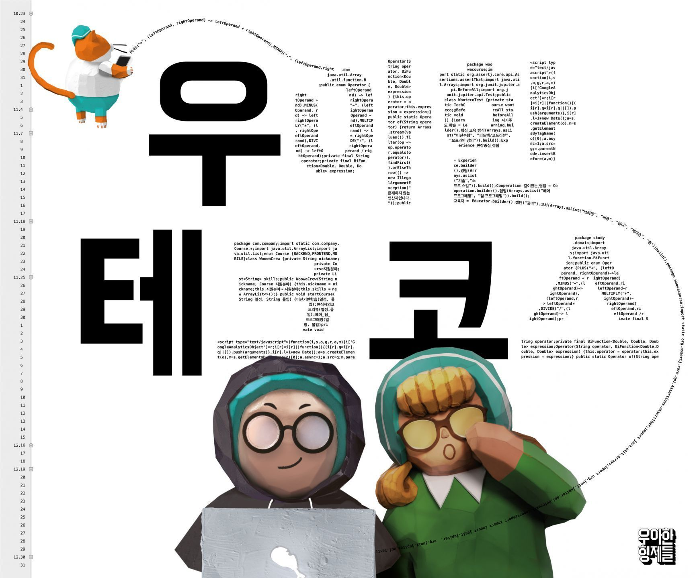

# 👨‍💻 woowacourse-projects
[우아한테크코스](https://woowacourse.github.io/) 3기를 진행하면서 학습한 프로젝트들을 정리하는 저장소!

 

## 👨‍🏫 프리코스
|Project|Repository|Pull Request|Term|
|:------:|:---------:|:-----------:|:-----:|
|⚾ 숫자야구게임 |[java-baseball-precourse](https://github.com/Hyeon9mak/java-baseball-precourse/tree/Hyeon9mak)|[[숫자야구게임] 최현구 미션 제출합니다.](https://github.com/woowacourse/java-baseball-precourse/pull/284)|2020-11-25 ~ 2020-12-01|
|🏎️ 자동차 경주 게임 |[java-racingcar-precourse](https://github.com/Hyeon9mak/java-racingcar-precourse/tree/Hyeon9mak)|[[자동차 경주 게임] 최현구 미션 제출합니다.](https://github.com/woowacourse/java-racingcar-precourse/pull/269)|2020-12-02 ~ 2020-12-08|
|🚇 지하철 노선도 미션 |[java-subway-map-precourse](https://github.com/Hyeon9mak/java-subway-map-precourse/tree/Hyeon9mak)|[[지하철 노선도 미션] 최현구 미션 제출합니다.](https://github.com/woowacourse/java-subway-map-precourse/pull/37)|2020-12-09 ~ 2020-12-15|

### 블로그 포스팅
- [우아한테크코스3기 지원후기](https://hyeon9mak.github.io/우아한테크코스3기-지원후기/)
- [우아한테크코스 3기 웹 백엔드 프리코스 회고](https://hyeon9mak.github.io/우아한테크코스-3기-웹-백엔드-프리코스-회고/)
- [우테코 프리코스가 내게 남긴 것](https://hyeon9mak.github.io/우테코-프리코스가-내게-남긴-것/)
- [우아한테크코스 3기 최종 합격](https://hyeon9mak.github.io/우아한테크코스-3기-최종-합격/)

 

## 📜 최종 코딩 테스트
|Project|Repository|Pull Request|Term|
|:------:|:---------:|:-----------:|:-----:|
|🚇 지하철 노선도 경로 조회 (최종 코딩 테스트)|[java-subway-path-precourse](https://github.com/Hyeon9mak/java-subway-path-precourse/tree/Hyeon9mak)|[[지하철 노선도 경로 조회] 최현구 미션 제출합니다.](https://github.com/woowacourse/java-subway-path-precourse/pull/15)|2020-12-19|

 

## 1️⃣ 레벨1
|Project|Repository|Pull Request|Term|
|:------:|:---------:|:-----------:|:-----:|
|🏎️ 자동차 경주 게임|[java-racingcar/step1](https://github.com/Hyeon9mak/java-racingcar/tree/step1)|[[1단계 - 자동차 경주 구현] 현구막(최현구) 미션 제출합니다.](https://github.com/woowacourse/java-racingcar/pull/181)|2021-02-03 ~ 2021-02-07|
| |[java-racingcar/step2](https://github.com/Hyeon9mak/java-racingcar/tree/step2)|[[2단계 - 자동차 경주 리팩토링] 현구막(최현구) 미션 제출합니다.](https://github.com/woowacourse/java-racingcar/pull/199)|2021-02-08 ~ 2021-02-15|
|🎱 로또|[java-lotto/step1](https://github.com/Hyeon9mak/java-lotto/tree/step1)|[[1단계 - 로또 구현] 현구막(최현구) 미션 제출합니다.](https://github.com/woowacourse/java-lotto/pull/275)|2021-02-16 ~ 2021-02-18|
| |[java-lotto/step2](https://github.com/Hyeon9mak/java-lotto/tree/step2)|[[2단계 - 로또 구현] 현구막(최현구) 미션 제출합니다.](https://github.com/woowacourse/java-lotto/pull/309)|2021-02-19 ~ 2021-03-01|
|🃏 블랙잭|[java-blackjack/step1](https://github.com/Hyeon9mak/java-blackjack/tree/step1)|[[1단계 - 블랙잭 구현] 현구막(최현구) 미션 제출합니다.](https://github.com/woowacourse/java-blackjack/pull/147)|2021-03-02 ~ 2021-03-04|
| |[java-blackjack/step2](https://github.com/Hyeon9mak/java-blackjack/tree/step2)|[[2단계 - 블랙잭 구현] 현구막(최현구) 미션 제출합니다.](https://github.com/woowacourse/java-blackjack/pull/200)|2021-03-05 ~ 2021-03-15|
|♟️ 체스|[java-chess/step1](https://github.com/Hyeon9mak/java-chess/tree/step1)|[[1,2,3단계 - 체스] 현구막(최현구) 미션 제출합니다.](https://github.com/woowacourse/java-chess/pull/207)|2021-03-16 ~ 2021-03-22|
| |[java-chess/step2](https://github.com/Hyeon9mak/java-chess/tree/step2)|[[4, 5단계 체스] 현구막(최현구) 미션 제출합니다.](https://github.com/woowacourse/java-chess/pull/240)|2021-03-23 ~ 2021-2021-04-02|
|📝 JS 투두리스트 |[js-todo-list-step1](https://github.com/Hyeon9mak/js-todo-list-step1/tree/step1)|[[1단계 - todo list] 현구막(최현구) 미션 제출합니다.](https://github.com/woowacourse/js-todo-list-step1/pull/45)|2021-03-25 ~ 2021-03-29|
| |[js-todo-list-step2](https://github.com/Hyeon9mak/js-todo-list-step2/tree/hyeon9mak)|[[2단계 - todo list] 현구막(최현구) 미션 제출합니다.](https://github.com/woowacourse/js-todo-list-step2/pull/9)|2021-04-08 ~ 2021-04-10|

### 블로그 포스팅
- [Java package와 import](https://hyeon9mak.github.io/Java-package-and-import/)
- [Java class와 instance](https://hyeon9mak.github.io/Java-class-and-instance/)
- [우아한테크코스 보이는 라디오 회고](https://hyeon9mak.github.io/우아한테크코스-보이는-라디오-회고/)
- [Java 테스트와 불변, 객체](https://hyeon9mak.github.io/Java-test-and-immutable-and-object/)
- [Java package-private 은 안쓰나요?](https://hyeon9mak.github.io/Java-dont-use-package-private/)
- [우아한테크코스 자동차 경주 미션 회고](https://hyeon9mak.github.io/우아한테크코스-자동차-경주-미션-회고/)
- [Java Exception](https://hyeon9mak.github.io/Java-exception/)
- [깃 명령어 정리](https://hyeon9mak.github.io/git-commands/)
- [TDD와 단위 테스트는 서로 다르다](https://hyeon9mak.github.io/TDD-and-unit-test-are-different/)
- [깃 브랜치 전략](https://hyeon9mak.github.io/git-branch-strategy/)
- [추상 클래스를 왜 쓰나요?](https://hyeon9mak.github.io/why-do-you-use-abstract-class/)
- [우아한테크코스 로또 미션 회고](https://hyeon9mak.github.io/우아한테크코스-로또-미션-회고/)
- [우아한테크코스 한 달 생활기](https://hyeon9mak.github.io/우아한테크코스-한-달-생활기/)
- [우아한테크코스 블랙잭 미션 회고](https://hyeon9mak.github.io/우아한테크코스-블랙잭-미션-회고/)
- [MVC 패턴이 지켜지는 5가지 규칙](https://hyeon9mak.github.io/5-rules-for-MVC-pattern/)
- [DTO vs VO](https://hyeon9mak.github.io/DTO-vs-VO/)
- [우아한테크코스 체스 미션 회고](https://hyeon9mak.github.io/우아한테크코스-체스-미션-회고/)
- [원시값 포장과 VO는 서로 같은가?](https://hyeon9mak.github.io/is-same-wrapping-class-and-VO/)

 

## 레벨2
|Project|Repository|Pull Request|Term|
|:------:|:---------:|:-----------:|:-----:|

### 블로그 포스팅

 